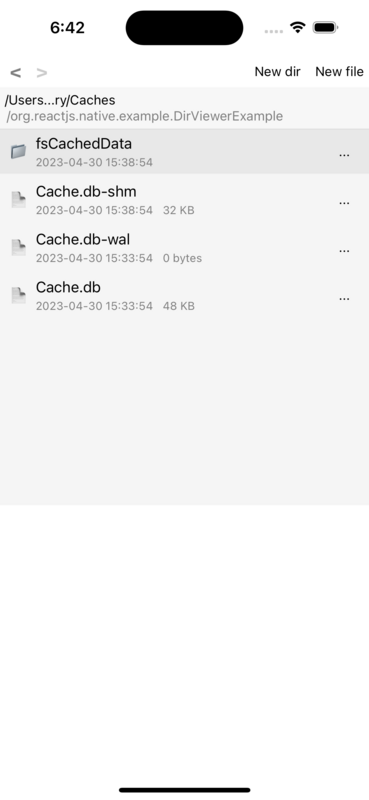

# react-native-dir-viewer

`react-native-dir-viewer` provide a component for intuitively visualizing directory structure (aka a simple GUI for your directory).

It supports:
- view basic info: modify time and content size
- navigate with back and forward (just like mac finder)
- create/rename/delete file/dir
- file edit (utf-8 content only)



## Installation
The lib depends on [`react-native-file-access`](https://github.com/alpha0010/react-native-file-access) for file operation, you need to install it first:

```sh
npm install react-native-file-access
npx pod-install
```

Then:
```shell
npm install react-native-dir-viewer
```

## Usage

```tsx
import * as React from 'react';

import { SafeAreaView } from 'react-native';
import { Dirs } from 'react-native-file-access';
import { DirReader } from 'react-native-dir-viewer';

export default function App() {
  return (
    <SafeAreaView>
      <DirReader
        baseDir={Dirs.CacheDir}
        listHeight={400}
        containerStyle={{}}
      />
    </SafeAreaView>
  );
}

```

Currently `DirReader` component not provide custom style control capability, it's mainly used for debug purpose


## License

MIT
